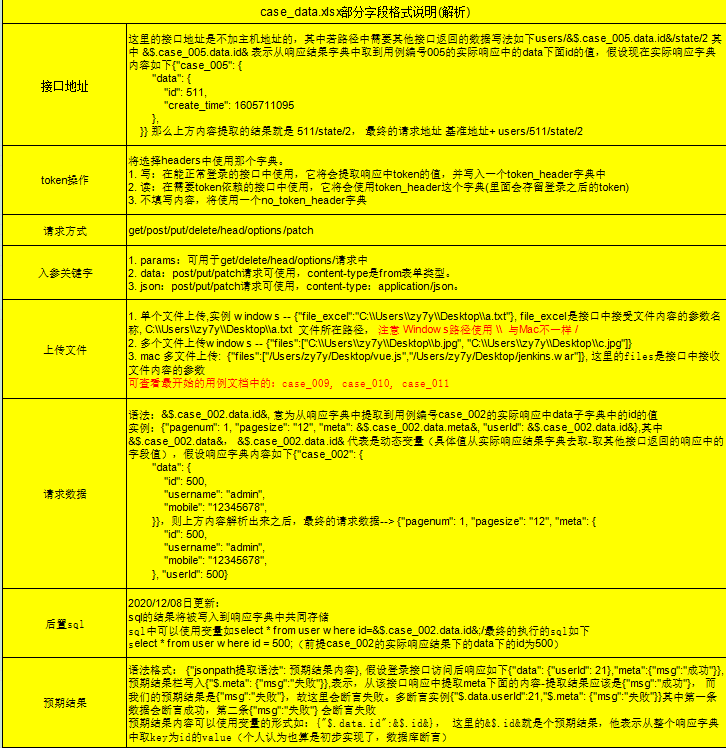
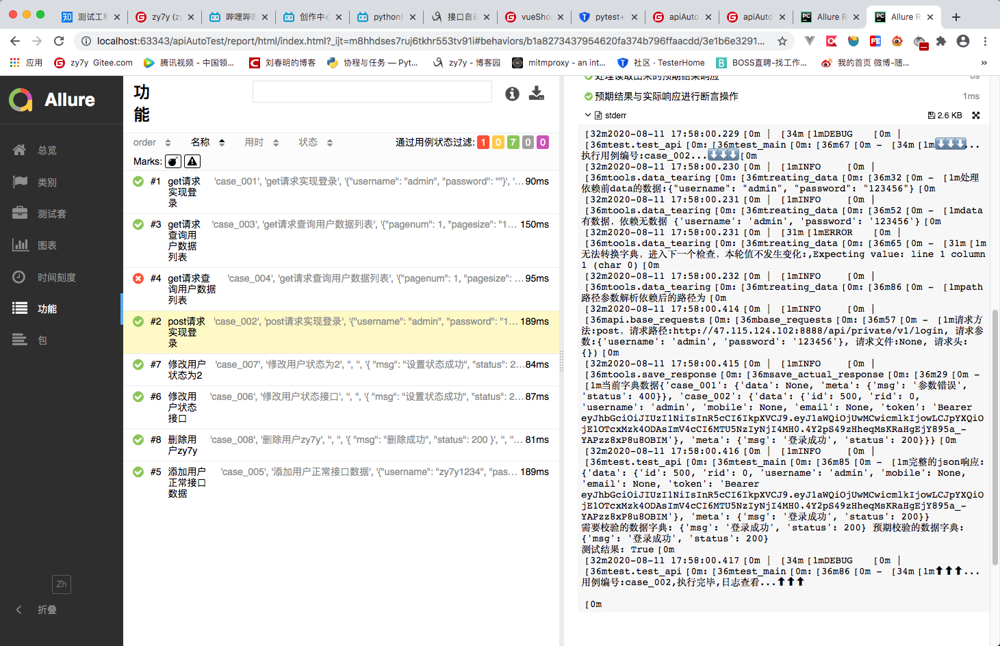
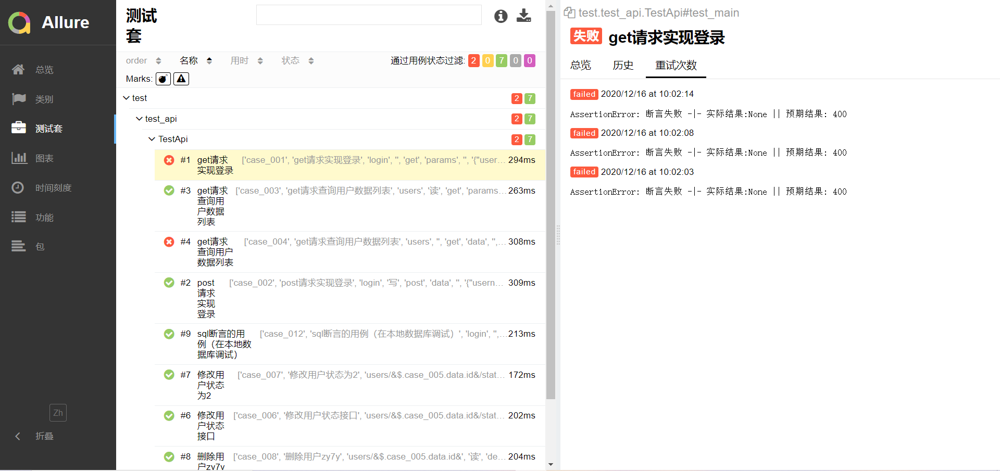

# apiAutoTest
> 使用Python为语言工具 + Python第三方库 实现的接口自动化测试工具
## 实现功能
- 测试数据隔离: 测试前后进行数据库备份/还原
- 接口直接的数据依赖: 需要B接口使用A接口响应中的某个字段作为参数
- 对接数据库： 讲数据库的查询结果可直接用于断言操作
- 动态多断言： 可（多个）动态提取实际预期结果与指定的预期结果进行比较断言操作
- 自定义扩展方法： 在用例中使用自定义方法(如：获取当前时间戳...)的返回值 
#### 软件架构
| 名称       | 版本   | 作用 |
| -------- | -------- | ---- |
| python                         | 3.7.8  |      |
| pytest                         | 6.0.1  | 底层单元测试框架,用来实现参数化，自动执行用例 |
| allure-pytest                  | 2.8.17 | allure与pytest的插件可以生成allure的测试报告 |
| jsonpath                       | 0.82   | 用来进行响应断言操作 |
| loguru                         | 0.54   | 记录日志 |
| PyYAML                         | 5.3.1  | 读取yml/yaml格式的配置文件 |
| Allure 												 | 2.13.5 | 要生成allure测试报告必须要在本机安装allure并配置环境变量 |
| xlrd                           | 1.2.0  | 用来读取excel中用例数据 |
| yagmail | 0.11.224 | 测试完成后发送邮件 |
| requests| 2.24.0 | 发送请求 |
|pymysql|0.10.1|连接mysql|
|paramiko|2.7.2|ssh连接linux服务器，用于备份/删除数据库文件
#### 目录结构
>apiAutoTest
>
>> .pytest_cache(文件夹): pytest运行测试文件的时候产生的文件
>>
>> api(包)：主请求
>>
>> > `__init__`.py
>> >
>> > base_requests.py: 封装了get、post、put、delete等接口请求
>>
>> config(文件夹)： 配置文件
>>
>> > config.yaml: 脚本配置文件（sever、提取规则）
>>
>> data(文件夹) 用例数据
>>
>> > case_data.xlsx: 测试用例
>>
>> ~~image(文件夹)~~
>>
>> > ...: gitee仓库中使用的静态文件资源
>>
>> log 日志文件
>>
>> > 运行日志文件.....: 运行代码时，脚本中打印的日志会存到这里。
>>
>> report(文件夹) 测试报告文件
>>
>> > data ： 每次执行测试用例的结果，存在这里
>> >
>> > html： 使用了allure 的一个命令，生成的本地可视化的一个html报告
>>
>> test(包): 运行文件所在包
>> > conftest.py: 存放可用于整个测试目录的方法 （2020/12/08 +）
>> > test_api.py：Pytest 命令可直接运行的测试文件，里面是我们的主函数
>>
>> tools(包): 工具包
>>
>> >`__init__.py`
>> >
>> >data_process.py：封装依赖数据与请求数据的逻辑处理，处理了path参数依赖，headers关键字参数的入参header
>> >
>> >db.py : 封装连接mysql方法
>> >read_file.py： 读取配置文件、读取excel用例文件
>> >
>> >data_clearing.py: 数据清洗方法封装，ssh2服务器连接，数据库备份/恢复 2021/01/19日更新 
>> >
>> >
>> >hooks.py: 自定义方法，可用与测试 目前版本拥有 获取当前时间戳，两数相加的方法 2021/02/27 更新
>> >
>> >send_email.py ： 发送邮件
>> >
>>
>> venv： python 虚拟环境
>>
>>
>> pytest.ini： pytest框架的一个可用配置，解决中文显示乱码
>>
>> requirements.txt： 依赖库
>>
>> 项目实战接口文档：该Demo中实例的电商后台项目接口文档
>>
>> run.py: 主运行文件，2020/12/06 更新
>>
>> test.sql 模拟用例sql的数据

#### 安装教程

1.  git clone  https://gitee.com/zy7y/apiAutoTest.git  /  https://github.com/zy7y/apiAutoTest.git
2.  安装Java与allure，https://www.cnblogs.com/zy7y/p/13403699.html
3.  使用pycharm打开项目使用Terminal 输入 python3 -m venv venv 新建虚拟环境 （可选）
4.  执行pip install -r requirements.txt 安装依赖库（若下载超时：pip install -i https://pypi.tuna.tsinghua.edu.cn/simple -r requirements.txt）
5.  修改config.ymal文件中email文件配置邮箱，request_header配置初始请求头，database 配置数据库信息
6. 运行 `run.py`文件
#### 用例说明文档

#### 使用说明

1.  本项目直接使用的requests.Session理论上实现了cookie请求的管理，不用单独提取cookie，支持前后端分离项目，兼容Restful接口规范。
2.  项目中token操作中为写时，请务必保证是能正常获得响应并且返回了token字段
3.  本项目用例书写格式请务必遵循，sheet页用例说明中有一部分
4.  该项目找的是b站上的一个前后端分离应用，域名使用的是b站某视频里提供的，请大家谨慎操作学习
5.  本项目所要投入生产，请自行修改配置文件config.yaml及用例数据case_data.xlsx，
6.  默认注释了用例失败重跑装饰器，需要的时候自行解除注释即可，但这个功能比较耗时间，自取所需吧
7.  本项目从2020年8月提交，陆续迭代，如果各位有什么建议 欢迎提给我，会尽力解决~~

#### 接口服务（后端源码来自）
vue 电商项目实战
教学视频：
https://www.bilibili.com/video/BV1EE411B7SU?p=10

服务提供者：https://space.bilibili.com/283273603?spm_id_from=333.788.b_636f6d6d656e74.6

#### 测试报告

#### 更新记录
2020/08/08 增加实际响应存储数据的方法，并在字典可以处理依赖见tools/svae_response.py

2020/08/09 实现多文件上传，接口中Path参数依赖处理

2020/11/18 使用re库解决当请求参数层级结构多出现无法提取的bug，减少冗余代码，优化path路径参数提取，更新用例填写说明文档

2020/11/21 更新用例文档，合并文件对象，文件地址，优化文件上传处理方式

2020/11/21 config.yaml文件中新增request_headers 选项，默认header在此设置，优化test_api.py文件，整合read_file.py

2020/11/22 优化请求断言方法支持用户自定义提取响应自定内容，支持多数据断言，整合请求方法，优化测试启动方法，部分日志移除，修改预期结果处理

2020/12/08 优化断言信息，增加数据库（支持mysql）查询操作， 使用`@pytest.fixture(scope="session")`来托管数据库对象，用例新增sql栏

2020/12/16 使用conftest.py 初始化用例， 增加失败重跑机制, 增加运行文件run，优化test_api.py冗余代码

2021/01/19 添加数据清洗功能(测试开始前进行数据库备份-分别在服务器和本地进行，测试结束后将备份用以恢复数据-将尝试从服务器和本地恢复到服务器数据库中，docker部署的mysql服务已本地调试通过，直接linux部署的mysql并未测试)
> 详细内容见代码注释`tools/data_clearing.py`
> 如不需要使用该功能请做如下处理,如也不使用数据库对象，只需参考 https://gitee.com/zy7y/apiAutoTest/issues/I2BAQL 修改即可

2021/02/27 添加hooks.py文件(可在此处自定义方法,并用于用例当中，注意请务必在定义的方法中使用return),移除上次更新的eval语法糖，增加用例处理前的日志

#### 博客园首发
https://www.cnblogs.com/zy7y/p/13426816.html

#### Jenkins集成

https://www.cnblogs.com/zy7y/p/13448102.html
#### 视频教程（该视频为2020年8月开源时录制，大致内容是简单讲个文件作用，其代码对应目前的version1.0分支）
B站：https://www.bilibili.com/video/BV1pv411i7zK/
#### 联系我

QQ：396667207

